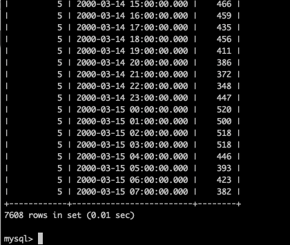
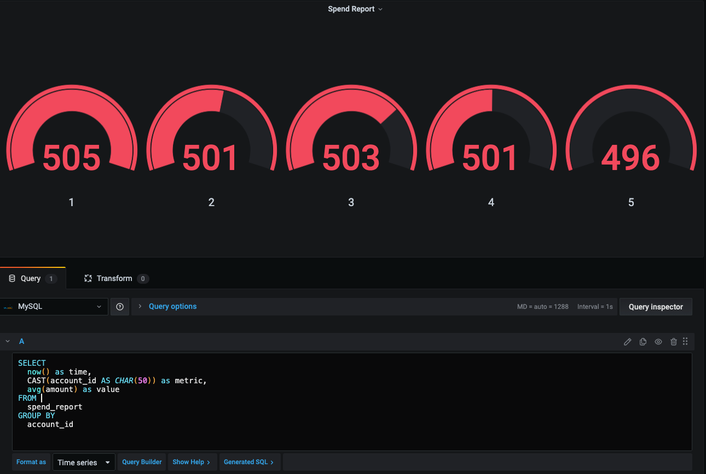

## 作业一 使用RDD API实现带词频的倒排索引

### 题目
完成 flink-playgrounds 练习

#### 1.代码环境

配置文件位于flink-playgrounds仓库中，首先检出该仓库并构建 docker镜像：

> git clone https://github.com/apache/flink-playgrounds.git
> cd flink-playgrounds/table-walkthrough

#### 2.如何运行和停止

在开始运行之前先在Docker主机上创建检查点和保存点目录 （如果不做这一步有可能报错）:

```jshelllanguage
mkdir -p /tmp/flink-checkpoints-directory
mkdir -p /tmp/flink-savepoints-directory 
```

编译打包代码:
```jshelllanguage
docker-compose build
```    
启动环境：
```jshelllanguage
docker-compose up -d
```
执行如下命令停止docker环境：
```jshelllanguage
docker-compose down -v 
```
#### 3.查看和验证

Flink WebUI界面 

> 打开浏览器并访问http://localhost:8082 

查看JobManager日志：
```jshelllanguage
docker-compose logs -f jobmanager
```
查看TaskManager日志：
```jshelllanguage
docker-compose logs -f taskmanager 
```
查看 MySQL 中的结果：
```jshelllanguage
docker-compose exec mysql mysql -Dsql-demo -usql-demo -pdemo-sql
mysql> use sql-demo;
mysql> select count(*) from spend_report;
mysql> select * from spend_report; 
```
在Grafana查看最终结果：
> http://localhost:3000/d/FOe0PbmGk/walkthrough?viewPanel=2&orgId=1&refre sh=5s

### 让我想想
本题来自 Flink 官方的练习

- [作业参考](https://ci.apache.org/projects/flink/flink-docs-release-1.13/docs/try-flink/table_api/)
- flink 的 window [函数参考](https://ci.apache.org/projects/flink/flink-docs-master/zh/docs/dev/table/tableapi/)

### 代码
```java
public class SpendReport {
    public static Table report(Table transactions) {
        return transactions
                .window(Slide.over(lit(5).hour()).every(lit(1).hour()).on($("transaction_time")).as("log_ts"))
                .groupBy($("account_id"), $("log_ts"))
                .select(
                        $("account_id"),
                        $("log_ts").start().as("log_ts"),
                        $("amount").avg().as("amount"));
    }

    public static void main(String[] args) throws Exception {
        EnvironmentSettings settings = EnvironmentSettings.newInstance().build();
        TableEnvironment tEnv = TableEnvironment.create(settings);
        //输入表transaction，用于读取信用卡交易数据，其中包含账户ID(account_id)，美元金额和时间戳
        tEnv.executeSql("CREATE TABLE transactions (\n" +
                "    account_id  BIGINT,\n" +
                "    amount      BIGINT,\n" +
                "    transaction_time TIMESTAMP(3),\n" +
                "    WATERMARK FOR transaction_time AS transaction_time - INTERVAL '5' SECOND\n" +
                ") WITH (\n" +
                "    'connector' = 'kafka',\n" +
                "    'topic'     = 'transactions',\n" +
                "    'properties.bootstrap.servers' = 'kafka:9092',\n" +
                "    'format'    = 'csv'\n" +
                ")");
        //输出表spend_report存储聚合结果，是mysql表
        tEnv.executeSql("CREATE TABLE spend_report (\n" +
                "    account_id BIGINT,\n" +
                "    log_ts     TIMESTAMP(3),\n" +
                "    amount     BIGINT\n," +
                "    PRIMARY KEY (account_id, log_ts) NOT ENFORCED" +
                ") WITH (\n" +
                "  'connector'  = 'jdbc',\n" +
                "  'url'        = 'jdbc:mysql://mysql:3306/sql-demo',\n" +
                "  'table-name' = 'spend_report',\n" +
                "  'driver'     = 'com.mysql.jdbc.Driver',\n" +
                "  'username'   = 'sql-demo',\n" +
                "  'password'   = 'demo-sql'\n" +
                ")");
        //将transactions表经过report函数处理后写入到spend_report表
        Table transactions = tEnv.from("transactions");
        report(transactions).executeInsert("spend_report");
    }
}
```

### 运行结果


