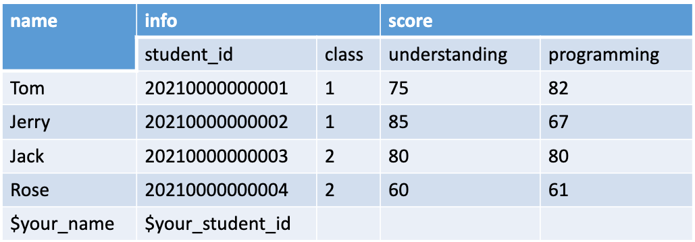
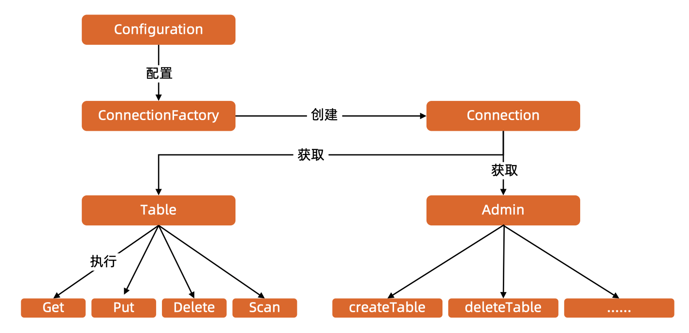
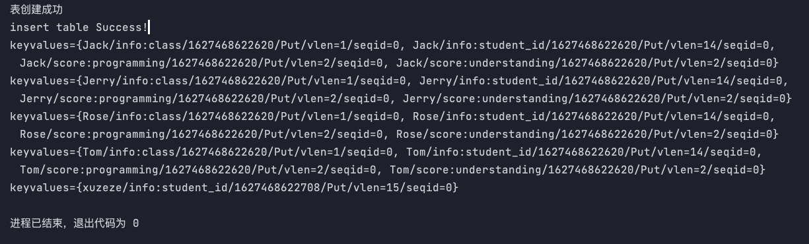
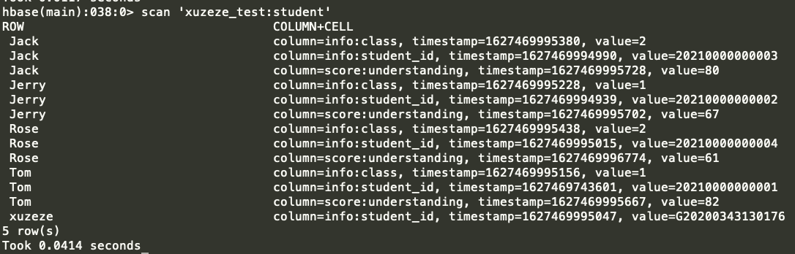

# 编程实践，使用 API 操作HBase
> 建表，插入数据，删除数据，查询等功能。建立一个如下所示的表




## JAVA API
### API 结构
- ConnectionFactory
    - Connection
        - Table
            - Get
            - Put
            - Delete
            - Scan
        - Admin
            - createTable
            - tableExists
            - deleteTable  
    



            
        

### 代码
```java
public class HBaseDemo {
    public static final String ZK_CONNECT_KEY = "hbase.zookeeper.quorum";
    public static final String ZK_CONNECT_VALUE = "47.101.204.23:2181,47.101.216.12:2181,47.101.206.249:2181";

    public static HBaseAdmin admin = null;
    public static Connection connection = null;

    static {
        Configuration conf = HBaseConfiguration.create();
        conf.set(ZK_CONNECT_KEY, ZK_CONNECT_VALUE);
        // 获取 connection 对象
        try {
            connection = ConnectionFactory.createConnection(conf);
            admin = (HBaseAdmin) connection.getAdmin();
        } catch (IOException e) {
            e.printStackTrace();
        }
    }


    public static void main(String[] args) throws Exception {

        //基本信息
        String tableName = "xuzeze_test:student";
        String[] cfs = {"info", "score"};

        //创建表
        creatTable(tableName, cfs);

        //放一条自己的信息
        Table table = connection.getTable(TableName.valueOf(tableName));
        Put put = new Put(Bytes.toBytes("xuzeze"));
        put.addColumn(Bytes.toBytes("info"), Bytes.toBytes("student_id"), Bytes.toBytes("G20200343130176"));
        table.put(put);

        //全表打印
        printTable(tableName);
//        deleteTable(tableName);

        //关闭
        admin.close();
        connection.close();

    }

    /**
     * @param tableName 表名
     * @param familys   列族
     * @throws Exception
     */
    public static void creatTable(String tableName, String[] familys) throws Exception {
        //表名
        TableName studentTable = TableName.valueOf(tableName);
        if (admin.tableExists(studentTable)) {
            System.out.println("stuent 表已存在，不信你看");

            //显示所有的表名
            TableName[] tableNames = admin.listTableNames();
            for (TableName t : tableNames) {
                System.out.println(t);
            }

        } else {
            //设置列族
            List<ColumnFamilyDescriptor> descriptorList = new ArrayList<>();
            for (String cf : familys) {
                ColumnFamilyDescriptor descriptor = ColumnFamilyDescriptorBuilder.newBuilder(Bytes.toBytes(cf))
                        .setDataBlockEncoding(DataBlockEncoding.PREFIX)
                        .setBloomFilterType(BloomType.ROW)
                        .build();
                descriptorList.add(descriptor);
            }

            //设置表信息
            TableDescriptor tableDescriptor = TableDescriptorBuilder.newBuilder(studentTable)
                    .setColumnFamilies(descriptorList)
                    .build();

            admin.createTable(tableDescriptor);
            if (admin.tableExists(studentTable)) {
                System.out.println("表创建成功");
            } else {
                System.out.println("表创建失败");
            }

            initData(tableName);
        }
    }


    /**
     * 删除表
     *
     * @param tableName 表名
     * @throws IOException
     */
    private static void deleteTable(String tableName) throws IOException {
        admin.disableTable(TableName.valueOf(tableName));
        admin.deleteTable(TableName.valueOf(tableName));
    }


    /**
     * 打印全表
     *
     * @param tableName 表名
     * @throws IOException
     */
    private static void printTable(String tableName) throws IOException {
        Table table = connection.getTable(TableName.valueOf(tableName));
        Scan scan = new Scan();
        ResultScanner scanner = table.getScanner(scan);
        printResultScanner(scanner);
    }


    /**
     * 打印结果
     *
     * @param rs hbase 的结果集
     */
    public static void printResultScanner(ResultScanner rs) {
        for (Result r : rs) {
            printResult(r);
        }

    }

    public static void printResult(Result result) {
        System.out.println(result);
    }


    /**
     * 初始化原始数据
     *
     * @param tableName 表名
     * @throws IOException
     */
    private static void initData(String tableName) throws IOException {

        Table table = connection.getTable(TableName.valueOf(tableName));
        List<Put> puts = new ArrayList<>();

        Put put = new Put(Bytes.toBytes("Tom"));
        put.addColumn(Bytes.toBytes("info"), Bytes.toBytes("student_id"), Bytes.toBytes("20210000000001"));
        put.addColumn(Bytes.toBytes("info"), Bytes.toBytes("class"), Bytes.toBytes("1"));
        put.addColumn(Bytes.toBytes("score"), Bytes.toBytes("understanding"), Bytes.toBytes("75"));
        put.addColumn(Bytes.toBytes("score"), Bytes.toBytes("programming"), Bytes.toBytes("82"));
        puts.add(put);

        put = new Put(Bytes.toBytes("Jerry"));
        put.addColumn(Bytes.toBytes("info"), Bytes.toBytes("student_id"), Bytes.toBytes("20210000000002"));
        put.addColumn(Bytes.toBytes("info"), Bytes.toBytes("class"), Bytes.toBytes("1"));
        put.addColumn(Bytes.toBytes("score"), Bytes.toBytes("understanding"), Bytes.toBytes("85"));
        put.addColumn(Bytes.toBytes("score"), Bytes.toBytes("programming"), Bytes.toBytes("67"));
        puts.add(put);

        put = new Put(Bytes.toBytes("Jack"));
        put.addColumn(Bytes.toBytes("info"), Bytes.toBytes("student_id"), Bytes.toBytes("20210000000003"));
        put.addColumn(Bytes.toBytes("info"), Bytes.toBytes("class"), Bytes.toBytes("2"));
        put.addColumn(Bytes.toBytes("score"), Bytes.toBytes("understanding"), Bytes.toBytes("80"));
        put.addColumn(Bytes.toBytes("score"), Bytes.toBytes("programming"), Bytes.toBytes("80"));
        puts.add(put);

        put = new Put(Bytes.toBytes("Rose"));
        put.addColumn(Bytes.toBytes("info"), Bytes.toBytes("student_id"), Bytes.toBytes("20210000000004"));
        put.addColumn(Bytes.toBytes("info"), Bytes.toBytes("class"), Bytes.toBytes("2"));
        put.addColumn(Bytes.toBytes("score"), Bytes.toBytes("understanding"), Bytes.toBytes("60"));
        put.addColumn(Bytes.toBytes("score"), Bytes.toBytes("programming"), Bytes.toBytes("61"));
        puts.add(put);

        table.put(puts);
        System.out.println("insert table Success!");
    }

}
```

### 运行结果


## HBase Shell
``` shell
# 创建表
create 'xuzeze_test:student','info','score'

# 插入数据
put 'xuzeze_test:student','Tom','info:student_id' ,'20210000000001'
put 'xuzeze_test:student','Jerry','info:student_id' ,'20210000000002'
put 'xuzeze_test:student','Jack','info:student_id' ,'20210000000003'
put 'xuzeze_test:student','Rose','info:student_id' ,'20210000000004'
put 'xuzeze_test:student','xuzeze','info:student_id' ,'G20200343130176'
put 'xuzeze_test:student','Tom','info:class' ,'1'
put 'xuzeze_test:student','Jerry','info:class' ,'1'
put 'xuzeze_test:student','Jack','info:class' ,'2'
put 'xuzeze_test:student','Rose','info:class' ,'2'
put 'xuzeze_test:student','Tom','score:understanding' ,'75'
put 'xuzeze_test:student','Jerry','score:understanding' ,'85'
put 'xuzeze_test:student','Jack','score:understanding' ,'80'
put 'xuzeze_test:student','Rose','score:understanding' ,'60'
put 'xuzeze_test:student','Tom','score:understanding' ,'82'
put 'xuzeze_test:student','Jerry','score:understanding' ,'67'
put 'xuzeze_test:student','Jack','score:understanding' ,'80'
put 'xuzeze_test:student','Rose','score:understanding' ,'61'

# 获取数据
get 'xuzeze_test:student','xuzeze'
# 扫描表
scan 'xuzeze_test:student'
# 统计总数
count 'xuzeze_test:student'
# 删除数据
delete 'xuzeze_test:student','xuzeze','info:student_id'
# 删除表：先 disable 再 drop
disable 'xuzeze_test:student'
drop 'xuzeze_test:student'
```

### 运行结果
