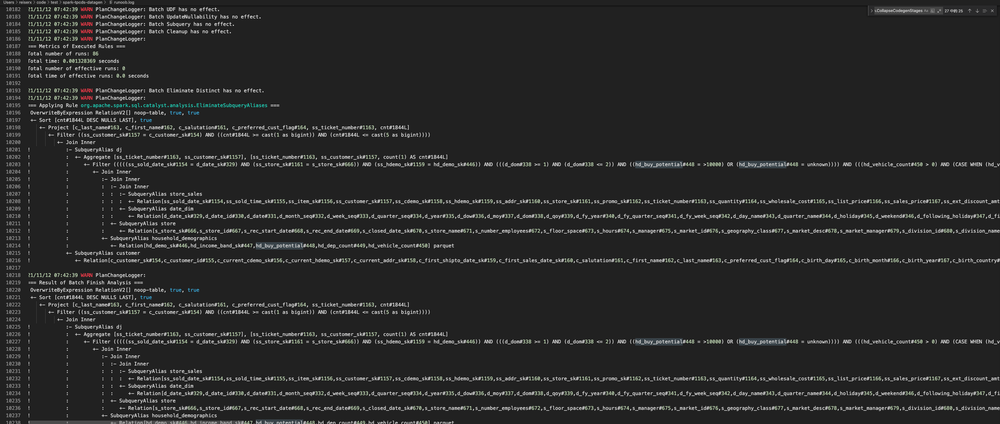
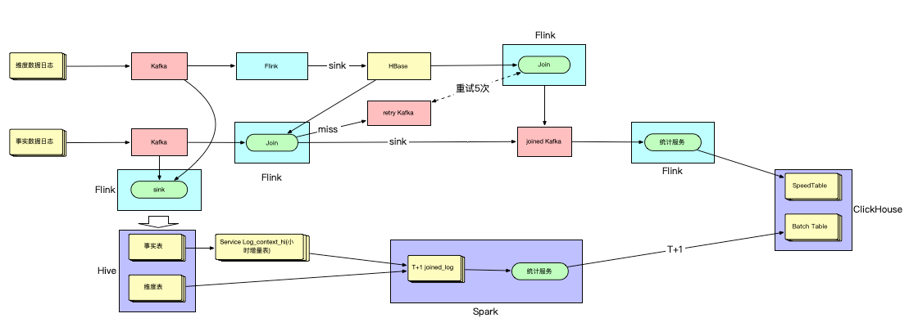
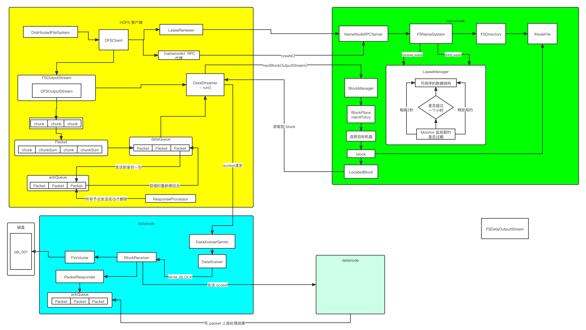
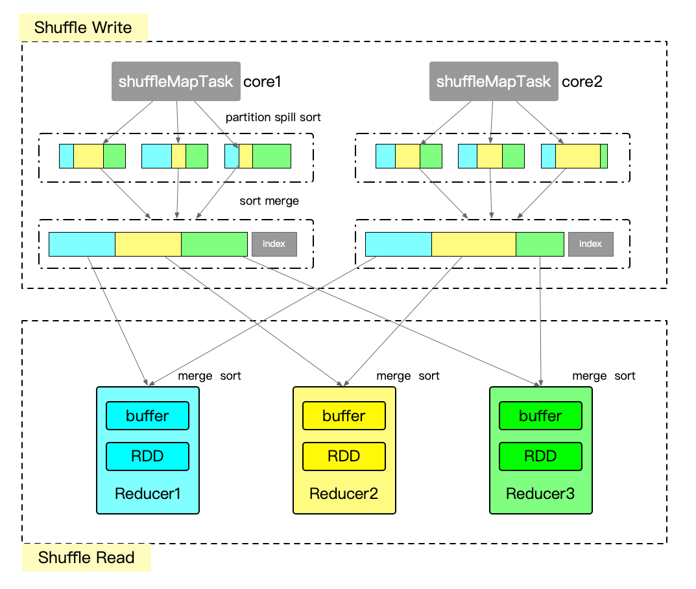

# 题目一：分析一条 TPCDS SQL
## 题目
> SQL 从中任意选择一条： https://github.com/apache/spark/tree/master/sql/core/src/test/resources/tpcds 
> 1. 运行该 SQL，如 q38，并截图该 SQL 的 SQL 执行图 
> 2. 该 SQL 用到了哪些优化规则（optimizer rules） 
> 3. 请各用不少于 200 字描述其中的两条优化规则 

帮助文档：如何运行该 SQL：
**1. 从 github 下载 TPCDS 数据生成器**

```shell
git clone https://github.com/maropu/spark-tpcds-datagen.git
cd spark-tpcds-datagen
```

**2. 下载 Spark3.1.1 到 spark-tpcds-datagen 目录并解压**

```shell
wget https://archive.apache.org/dist/spark/spark-3.1.1/spark-3.1.1-bin-hadoop2.7.tgz
tar -zxvf spark-3.1.1-bin-hadoop2.7.tgz
```
**3. 生成数据**

```shell
mkdir -p tpcds-data-1g
export SPARK_HOME=./spark-3.1.1-bin-hadoop2.7
./bin/dsdgen --output-location tpcds-data-1g
```

**4. 下载三个 test jar 并放到当前目录**

```shell
wget https://repo1.maven.org/maven2/org/apache/spark/spark-catalyst_2.12/3.1.1/spark-catalyst_2.12-3.1.1-tests.jar
wget https://repo1.maven.org/maven2/org/apache/spark/spark-core_2.12/3.1.1/spark-core_2.12-3.1.1-tests.jar
wget https://repo1.maven.org/maven2/org/apache/spark/spark-sql_2.12/3.1.1/spark-sql_2.12-3.1.1-tests.jar
```

**5. 执行 SQL**

```shell
nohup
./spark-3.1.1-bin-hadoop2.7/bin/spark-submit \
--conf spark.sql.planChangeLog.level=WARN \
--class org.apache.spark.sql.execution.benchmark.TPCDSQueryBenchmark \
--jars spark-core_2.12-3.1.1-tests.jar,spark-catalyst_2.12-3.1.1-tests.jar \
spark-sql_2.12-3.1.1-tests.jar \
--data-location tpcds-data-1g --query-filter "q73"\
> running.log 2>&1 &
```

**q73.sql**
```sql
SELECT
  c_last_name,
  c_first_name,
  c_salutation,
  c_preferred_cust_flag,
  ss_ticket_number,
  cnt
FROM
  (SELECT
    ss_ticket_number,
    ss_customer_sk,
    count(*) cnt
  FROM store_sales, date_dim, store, household_demographics
  WHERE store_sales.ss_sold_date_sk = date_dim.d_date_sk
    AND store_sales.ss_store_sk = store.s_store_sk
    AND store_sales.ss_hdemo_sk = household_demographics.hd_demo_sk
    AND date_dim.d_dom BETWEEN 1 AND 2
    AND (household_demographics.hd_buy_potential = '>10000' OR
    household_demographics.hd_buy_potential = 'unknown')
    AND household_demographics.hd_vehicle_count > 0
    AND CASE WHEN household_demographics.hd_vehicle_count > 0
    THEN
      household_demographics.hd_dep_count / household_demographics.hd_vehicle_count
        ELSE NULL END > 1
    AND date_dim.d_year IN (1999, 1999 + 1, 1999 + 2)
    AND store.s_county IN ('Williamson County', 'Franklin Parish', 'Bronx County', 'Orange County')
  GROUP BY ss_ticket_number, ss_customer_sk) dj, customer
WHERE ss_customer_sk = c_customer_sk
  AND cnt BETWEEN 1 AND 5
ORDER BY cnt DESC
```
## 运行结果

### 执行图



### optimizer rules
- ReorderJoin Join顺序优化
- PushDownPredicates：谓词下推
- ColumnPruning：列裁剪
- NullPropagation：Null 提取
- ConstantFolding：常数折叠
- InferFiltersFromConstraints 约束条件提取
- RewritePredicateSubquery 依赖子查询重写

**1.PushDownPredicates**
```
=== Applying Rule org.apache.spark.sql.catalyst.optimizer.PushDownPredicates ===
OverwriteByExpression RelationV2[] noop-table, true, true                                                                                                                                                                                                                                                                                                                                                                                                                                                                
+- Sort [cnt#1828L DESC NULLS LAST], true                                                                                                                                                                                                                                                                                                                                                                                                                                                                                
+- Project [c_last_name#163, c_first_name#162, c_salutation#161, c_preferred_cust_flag#164, ss_ticket_number#1163, cnt#1828L]                                                                                                                                                                                                                                                                                                                                                                                            
!      +- Filter ((ss_customer_sk#1157 = c_customer_sk#154) AND ((cnt#1828L >= cast(1 as bigint)) AND (cnt#1828L <= cast(5 as bigint))))                                                                                                                                                                                                                                                                                                                                                                                 
!         +- Join Inner                                                                                                                                                                                                                                                                                                                                                                                                                                                                                                  
!            :- Aggregate [ss_ticket_number#1163, ss_customer_sk#1157], [ss_ticket_number#1163, ss_customer_sk#1157, count(1) AS cnt#1828L]                                                                                                                                                                                                                                                                                                                                                                              
!            :  +- Join Inner, ((((ss_hdemo_sk#1159 = hd_demo_sk#446) AND ((hd_buy_potential#448 = >10000) OR (hd_buy_potential#448 = unknown))) AND (hd_vehicle_count#450 > 0)) AND (CASE WHEN (hd_vehicle_count#450 > 0) THEN (cast(hd_dep_count#449 as double) / cast(hd_vehicle_count#450 as double)) ELSE cast(null as double) END > cast(1 as double)))                                                                                                                                                            
!            :     :- Join Inner, ((ss_store_sk#1161 = s_store_sk#666) AND s_county#689 IN (Williamson County,Franklin Parish,Bronx County,Orange County))                                                                                                                                                                                                                                                                                                                                                               
!            :     :  :- Join Inner, ((((ss_sold_date_sk#1154 = d_date_sk#329) AND (d_dom#338 >= 1)) AND (d_dom#338 <= 2)) AND d_year#335 IN (1999,(1999 + 1),(1999 + 2)))                                                                                                                                                                                                                                                                                                                                               
!            :     :  :  :- Relation[ss_sold_date_sk#1154,ss_sold_time_sk#1155,ss_item_sk#1156,ss_customer_sk#1157,ss_cdemo_sk#1158,ss_hdemo_sk#1159,ss_addr_sk#1160,ss_store_sk#1161,ss_promo_sk#1162,ss_ticket_number#1163,ss_quantity#1164,ss_wholesale_cost#1165,ss_list_price#1166,ss_sales_price#1167,ss_ext_discount_amt#1168,ss_ext_sales_price#1169,ss_ext_wholesale_cost#1170,ss_ext_list_price#1171,ss_ext_tax#1172,ss_coupon_amt#1173,ss_net_paid#1174,ss_net_paid_inc_tax#1175,ss_net_profit#1176] parquet  
!            :     :  :  +- Relation[d_date_sk#329,d_date_id#330,d_date#331,d_month_seq#332,d_week_seq#333,d_quarter_seq#334,d_year#335,d_dow#336,d_moy#337,d_dom#338,d_qoy#339,d_fy_year#340,d_fy_quarter_seq#341,d_fy_week_seq#342,d_day_name#343,d_quarter_name#344,d_holiday#345,d_weekend#346,d_following_holiday#347,d_first_dom#348,d_last_dom#349,d_same_day_ly#350,d_same_day_lq#351,d_current_day#352,... 4 more fields] parquet                                                                               
!            :     :  +- Relation[s_store_sk#666,s_store_id#667,s_rec_start_date#668,s_rec_end_date#669,s_closed_date_sk#670,s_store_name#671,s_number_employees#672,s_floor_space#673,s_hours#674,s_manager#675,s_market_id#676,s_geography_class#677,s_market_desc#678,s_market_manager#679,s_division_id#680,s_division_name#681,s_company_id#682,s_company_name#683,s_street_number#684,s_street_name#685,s_street_type#686,s_suite_number#687,s_city#688,s_county#689,... 5 more fields] parquet                    
!            :     +- Relation[hd_demo_sk#446,hd_income_band_sk#447,hd_buy_potential#448,hd_dep_count#449,hd_vehicle_count#450] parquet                                                                                                                                                                                                                                                                                                                                                                                  
!            +- Relation[c_customer_sk#154,c_customer_id#155,c_current_cdemo_sk#156,c_current_hdemo_sk#157,c_current_addr_sk#158,c_first_shipto_date_sk#159,c_first_sales_date_sk#160,c_salutation#161,c_first_name#162,c_last_name#163,c_preferred_cust_flag#164,c_birth_day#165,c_birth_month#166,c_birth_year#167,c_birth_country#168,c_login#169,c_email_address#170,c_last_review_date#171] parquet                                                                                                                 
!                                                                                                                                                                                                                                                                                                                                                                                                                                                                                                                        
!                                                                                                                                                                                                                                                                                                                                                                                                                                                                                                                      
OverwriteByExpression RelationV2[] noop-table, true, true
+- Sort [cnt#1828L DESC NULLS LAST], true
+- Project [c_last_name#163, c_first_name#162, c_salutation#161, c_preferred_cust_flag#164, ss_ticket_number#1163, cnt#1828L]
+- Join Inner, (ss_customer_sk#1157 = c_customer_sk#154)
:- Filter ((cnt#1828L >= cast(1 as bigint)) AND (cnt#1828L <= cast(5 as bigint)))
:  +- Aggregate [ss_ticket_number#1163, ss_customer_sk#1157], [ss_ticket_number#1163, ss_customer_sk#1157, count(1) AS cnt#1828L]
:     +- Join Inner, (ss_hdemo_sk#1159 = hd_demo_sk#446)
:        :- Join Inner, (ss_store_sk#1161 = s_store_sk#666)
:        :  :- Join Inner, (ss_sold_date_sk#1154 = d_date_sk#329)
:        :  :  :- Relation[ss_sold_date_sk#1154,ss_sold_time_sk#1155,ss_item_sk#1156,ss_customer_sk#1157,ss_cdemo_sk#1158,ss_hdemo_sk#1159,ss_addr_sk#1160,ss_store_sk#1161,ss_promo_sk#1162,ss_ticket_number#1163,ss_quantity#1164,ss_wholesale_cost#1165,ss_list_price#1166,ss_sales_price#1167,ss_ext_discount_amt#1168,ss_ext_sales_price#1169,ss_ext_wholesale_cost#1170,ss_ext_list_price#1171,ss_ext_tax#1172,ss_coupon_amt#1173,ss_net_paid#1174,ss_net_paid_inc_tax#1175,ss_net_profit#1176] parquet
:        :  :  +- Filter (((d_dom#338 >= 1) AND (d_dom#338 <= 2)) AND d_year#335 IN (1999,(1999 + 1),(1999 + 2)))
:        :  :     +- Relation[d_date_sk#329,d_date_id#330,d_date#331,d_month_seq#332,d_week_seq#333,d_quarter_seq#334,d_year#335,d_dow#336,d_moy#337,d_dom#338,d_qoy#339,d_fy_year#340,d_fy_quarter_seq#341,d_fy_week_seq#342,d_day_name#343,d_quarter_name#344,d_holiday#345,d_weekend#346,d_following_holiday#347,d_first_dom#348,d_last_dom#349,d_same_day_ly#350,d_same_day_lq#351,d_current_day#352,... 4 more fields] parquet
:        :  +- Filter s_county#689 IN (Williamson County,Franklin Parish,Bronx County,Orange County)
:        :     +- Relation[s_store_sk#666,s_store_id#667,s_rec_start_date#668,s_rec_end_date#669,s_closed_date_sk#670,s_store_name#671,s_number_employees#672,s_floor_space#673,s_hours#674,s_manager#675,s_market_id#676,s_geography_class#677,s_market_desc#678,s_market_manager#679,s_division_id#680,s_division_name#681,s_company_id#682,s_company_name#683,s_street_number#684,s_street_name#685,s_street_type#686,s_suite_number#687,s_city#688,s_county#689,... 5 more fields] parquet
:        +- Filter ((((hd_buy_potential#448 = >10000) OR (hd_buy_potential#448 = unknown)) AND (hd_vehicle_count#450 > 0)) AND (CASE WHEN (hd_vehicle_count#450 > 0) THEN (cast(hd_dep_count#449 as double) / cast(hd_vehicle_count#450 as double)) ELSE cast(null as double) END > cast(1 as double)))
:           +- Relation[hd_demo_sk#446,hd_income_band_sk#447,hd_buy_potential#448,hd_dep_count#449,hd_vehicle_count#450] parquet
+- Relation[c_customer_sk#154,c_customer_id#155,c_current_cdemo_sk#156,c_current_hdemo_sk#157,c_current_addr_sk#158,c_first_shipto_date_sk#159,c_first_sales_date_sk#160,c_salutation#161,c_first_name#162,c_last_name#163,c_preferred_cust_flag#164,c_birth_day#165,c_birth_month#166,c_birth_year#167,c_birth_country#168,c_login#169,c_email_address#170,c_last_review_date#171] parquet
```
**说明**
第一部分
最外部的筛选条件 `WHERE ss_customer_sk = c_customer_sk AND cnt BETWEEN 1 AND 5` 
- `ss_customer_sk = c_customer_sk` 将 `Join Inner` 变成了 `Join Inner, (ss_customer_sk#1157 = c_customer_sk#154)`
- `cnt BETWEEN 1 AND 5` 下推到 Join 之前 `Filter ((cnt#1828L >= cast(1 as bigint)) AND (cnt#1828L <= cast(5 as bigint)))`

第二部分
关联查询 `FROM store_sales, date_dim, store, household_demographics` 的筛选条件 `Filter ((ss_customer_sk#1157 = c_customer_sk#154) AND ((cnt#1828L >= cast(1 as bigint)) AND (cnt#1828L <= cast(5 as bigint))))`
会被提前到各张表 `Join Inner` 之前，变成了先筛选再 Join


**2.ColumnPruning** 

```
=== Applying Rule org.apache.spark.sql.catalyst.optimizer.ColumnPruning ===
=== 优化前
 OverwriteByExpression RelationV2[] noop-table, true, true                                                                                                                                                                                                                                                                                                                                                                                                                                                                 
 +- Sort [cnt#1860L DESC NULLS LAST], true                                                                                                                                                                                                                                                                                                                                                                                                                                                                                 
    +- Project [c_last_name#163, c_first_name#162, c_salutation#161, c_preferred_cust_flag#164, ss_ticket_number#1163, cnt#1860L]                                                                                                                                                                                                                                                                                                                                                                                          
       +- Join Inner, (ss_customer_sk#1157 = c_customer_sk#154)                                                                                                                                                                                                                                                                                                                                                                                                                                                            
          :- Filter ((cnt#1860L >= cast(1 as bigint)) AND (cnt#1860L <= cast(5 as bigint)))                                                                                                                                                                                                                                                                                                                                                                                                                                
          :  +- Aggregate [ss_ticket_number#1163, ss_customer_sk#1157], [ss_ticket_number#1163, ss_customer_sk#1157, count(1) AS cnt#1860L]                                                                                                                                                                                                                                                                                                                                                                                
!         :     +- Join Inner, (ss_hdemo_sk#1159 = hd_demo_sk#446)                                                                                                                                                                                                                                                                                                                                                                                                                                                         
!         :        :- Join Inner, (ss_store_sk#1161 = s_store_sk#666)                                                                                                                                                                                                                                                                                                                                                                                                                                                      
!         :        :  :- Join Inner, (ss_sold_date_sk#1154 = d_date_sk#329)                                                                                                                                                                                                                                                                                                                                                                                                                                                
!         :        :  :  :- Relation[ss_sold_date_sk#1154,ss_sold_time_sk#1155,ss_item_sk#1156,ss_customer_sk#1157,ss_cdemo_sk#1158,ss_hdemo_sk#1159,ss_addr_sk#1160,ss_store_sk#1161,ss_promo_sk#1162,ss_ticket_number#1163,ss_quantity#1164,ss_wholesale_cost#1165,ss_list_price#1166,ss_sales_price#1167,ss_ext_discount_amt#1168,ss_ext_sales_price#1169,ss_ext_wholesale_cost#1170,ss_ext_list_price#1171,ss_ext_tax#1172,ss_coupon_amt#1173,ss_net_paid#1174,ss_net_paid_inc_tax#1175,ss_net_profit#1176] parquet    
!         :        :  :  +- Filter (((d_dom#338 >= 1) AND (d_dom#338 <= 2)) AND d_year#335 IN (1999,(1999 + 1),(1999 + 2)))                                                                                                                                                                                                                                                                                                                                                                                                
!         :        :  :     +- Relation[d_date_sk#329,d_date_id#330,d_date#331,d_month_seq#332,d_week_seq#333,d_quarter_seq#334,d_year#335,d_dow#336,d_moy#337,d_dom#338,d_qoy#339,d_fy_year#340,d_fy_quarter_seq#341,d_fy_week_seq#342,d_day_name#343,d_quarter_name#344,d_holiday#345,d_weekend#346,d_following_holiday#347,d_first_dom#348,d_last_dom#349,d_same_day_ly#350,d_same_day_lq#351,d_current_day#352,... 4 more fields] parquet                                                                              
!         :        :  +- Filter s_county#689 IN (Williamson County,Franklin Parish,Bronx County,Orange County)                                                                                                                                                                                                                                                                                                                                                                                                             
!         :        :     +- Relation[s_store_sk#666,s_store_id#667,s_rec_start_date#668,s_rec_end_date#669,s_closed_date_sk#670,s_store_name#671,s_number_employees#672,s_floor_space#673,s_hours#674,s_manager#675,s_market_id#676,s_geography_class#677,s_market_desc#678,s_market_manager#679,s_division_id#680,s_division_name#681,s_company_id#682,s_company_name#683,s_street_number#684,s_street_name#685,s_street_type#686,s_suite_number#687,s_city#688,s_county#689,... 5 more fields] parquet                   
!         :        +- Filter ((((hd_buy_potential#448 = >10000) OR (hd_buy_potential#448 = unknown)) AND (hd_vehicle_count#450 > 0)) AND (CASE WHEN (hd_vehicle_count#450 > 0) THEN (cast(hd_dep_count#449 as double) / cast(hd_vehicle_count#450 as double)) ELSE cast(null as double) END > cast(1 as double)))                                                                                                                                                                                                          
!         :           +- Relation[hd_demo_sk#446,hd_income_band_sk#447,hd_buy_potential#448,hd_dep_count#449,hd_vehicle_count#450] parquet                                                                                                                                                                                                                                                                                                                                                                                 
!         +- Relation[c_customer_sk#154,c_customer_id#155,c_current_cdemo_sk#156,c_current_hdemo_sk#157,c_current_addr_sk#158,c_first_shipto_date_sk#159,c_first_sales_date_sk#160,c_salutation#161,c_first_name#162,c_last_name#163,c_preferred_cust_flag#164,c_birth_day#165,c_birth_month#166,c_birth_year#167,c_birth_country#168,c_login#169,c_email_address#170,c_last_review_date#171] parquet                                                                                                                      
!                                                                                                                                                                                                                                                                                                                                                                                                                                                                                                                          

=== 优化后
RelationV2[] noop-table, true, true
Sort [cnt#1860L DESC NULLS LAST], true
Project [c_last_name#163, c_first_name#162, c_salutation#161, c_preferred_cust_flag#164, ss_ticket_number#1163, cnt#1860L]
Join Inner, (ss_customer_sk#1157 = c_customer_sk#154)
Filter ((cnt#1860L >= cast(1 as bigint)) AND (cnt#1860L <= cast(5 as bigint)))
 +- Aggregate [ss_ticket_number#1163, ss_customer_sk#1157], [ss_ticket_number#1163, ss_customer_sk#1157, count(1) AS cnt#1860L]
    +- Project [ss_customer_sk#1157, ss_ticket_number#1163]
       +- Join Inner, (ss_hdemo_sk#1159 = hd_demo_sk#446)
          :- Project [ss_customer_sk#1157, ss_hdemo_sk#1159, ss_ticket_number#1163]
          :  +- Join Inner, (ss_store_sk#1161 = s_store_sk#666)
          :     :- Project [ss_customer_sk#1157, ss_hdemo_sk#1159, ss_store_sk#1161, ss_ticket_number#1163]
          :     :  +- Join Inner, (ss_sold_date_sk#1154 = d_date_sk#329)
          :     :     :- Project [ss_sold_date_sk#1154, ss_customer_sk#1157, ss_hdemo_sk#1159, ss_store_sk#1161, ss_ticket_number#1163]
          :     :     :  +- Relation[ss_sold_date_sk#1154,ss_sold_time_sk#1155,ss_item_sk#1156,ss_customer_sk#1157,ss_cdemo_sk#1158,ss_hdemo_sk#1159,ss_addr_sk#1160,ss_store_sk#1161,ss_promo_sk#1162,ss_ticket_number#1163,ss_quantity#1164,ss_wholesale_cost#1165,ss_list_price#1166,ss_sales_price#1167,ss_ext_discount_amt#1168,ss_ext_sales_price#1169,ss_ext_wholesale_cost#1170,ss_ext_list_price#1171,ss_ext_tax#1172,ss_coupon_amt#1173,ss_net_paid#1174,ss_net_paid_inc_tax#1175,ss_net_profit#1176] parquet
          :     :     +- Project [d_date_sk#329]
          :     :        +- Filter (((d_dom#338 >= 1) AND (d_dom#338 <= 2)) AND d_year#335 IN (1999,(1999 + 1),(1999 + 2)))
          :     :           +- Relation[d_date_sk#329,d_date_id#330,d_date#331,d_month_seq#332,d_week_seq#333,d_quarter_seq#334,d_year#335,d_dow#336,d_moy#337,d_dom#338,d_qoy#339,d_fy_year#340,d_fy_quarter_seq#341,d_fy_week_seq#342,d_day_name#343,d_quarter_name#344,d_holiday#345,d_weekend#346,d_following_holiday#347,d_first_dom#348,d_last_dom#349,d_same_day_ly#350,d_same_day_lq#351,d_current_day#352,... 4 more fields] parquet
          :     +- Project [s_store_sk#666]
          :        +- Filter s_county#689 IN (Williamson County,Franklin Parish,Bronx County,Orange County)
          :           +- Relation[s_store_sk#666,s_store_id#667,s_rec_start_date#668,s_rec_end_date#669,s_closed_date_sk#670,s_store_name#671,s_number_employees#672,s_floor_space#673,s_hours#674,s_manager#675,s_market_id#676,s_geography_class#677,s_market_desc#678,s_market_manager#679,s_division_id#680,s_division_name#681,s_company_id#682,s_company_name#683,s_street_number#684,s_street_name#685,s_street_type#686,s_suite_number#687,s_city#688,s_county#689,... 5 more fields] parquet
          +- Project [hd_demo_sk#446]
             +- Filter ((((hd_buy_potential#448 = >10000) OR (hd_buy_potential#448 = unknown)) AND (hd_vehicle_count#450 > 0)) AND (CASE WHEN (hd_vehicle_count#450 > 0) THEN (cast(hd_dep_count#449 as double) / cast(hd_vehicle_count#450 as double)) ELSE cast(null as double) END > cast(1 as double)))
                +- Relation[hd_demo_sk#446,hd_income_band_sk#447,hd_buy_potential#448,hd_dep_count#449,hd_vehicle_count#450] parquet
Project [c_customer_sk#154, c_salutation#161, c_first_name#162, c_last_name#163, c_preferred_cust_flag#164]
Relation[c_customer_sk#154,c_customer_id#155,c_current_cdemo_sk#156,c_current_hdemo_sk#157,c_current_addr_sk#158,c_first_shipto_date_sk#159,c_first_sales_date_sk#160,c_salutation#161,c_first_name#162,c_last_name#163,c_preferred_cust_flag#164,c_birth_day#165,c_birth_month#166,c_birth_year#167,c_birth_country#168,c_login#169,c_email_address#170,c_last_review_date#171] parquet                                                                                                                                                                                                                                                                                                                                                                                                                                                                                                                        
```
**说明**
只提取对后面有用的列，减少数据量。如：
- store_sales 表只提取 `ss_customer_sk`, `ss_hdemo_sk`, `ss_store_sk`, `ss_ticket_number`
- date_dim 表只提取 `d_date_sk`
- store 表只提取 `s_store_sk`
- household_demographic 表只提取 `hd_demo_sk`


# 题目二：架构设计题
## 题目
> 你是某互联网公司的大数据平台架构师，请设计一套基于 Lambda 架构的数据平台架构，要求尽可能多的把课程中涉及的组件添加到该架构图中。并描述 Lambda 架构的优缺点。

## 架构图


## 思路
> 用户的事实数据回流到服务器时需要维度数据关联，有几个问题需要解决
1. 维度数据存在哪里？存多久
2. 事实数据如果关联失败怎么处理
3. 实时部分如何保证端到端的数据一致性

## 说明
1. 维度日志数据通过 Kafka 到 Flink_Dim_Log 中，直接 sink 到 HBase，并保存一个月
2. 事实日志数据通过 Kafka 到 Flink_Fact_Log 中，从 HBase 通过主键获取维度信息进行 join
   1. Join 成功直接 sink 到 Kafka_Joined
   2. Join 失败 sink 到 Kafka_Retry 去重试
3. Kafka_Joined 被 Flink_ETL 消费做统计操作并 sink 到 ClickHouse 的 SpeedTable
4. Kafka_Retry 被 Flink_Retry 消费并重新 join
    1. Join 成功直接 sink 到 Kafka_Joined
    2. Join 失败 sink 到 Kafka_Retry 去重试，重试 5 次仍然失败则放弃，交给离线修复
5. 一开始的维度日志数据、事实日志数据的 Kafka 消息会被 Flink_Hive 消费并 sink 到 Hive
6. Hive 表的数据会被 Spark 每个小时 join 并统计一次，sink 到 ClickHouse 的 BatchTable
7. 使用时，新数据查询 SpeedTable，老数据查询 BatchTable

# 题目三：原理题
## HDFS 的读写流程



1. 客户端通过 RPC 调用 NameNode 的 NameNodeRpcServer
2. NameNode 回将最近的元数据更新到内存，磁盘和 JournalNode
    1. 更新内存：更新元数据到 FSDirectory
    2. 更新磁盘：EditLog 写入到本地磁盘
    3. 更新 JournalNode：EditLog 发送给 JournalNode
3. JournalNode 把 EditLog 通过 Http 发送给 SecondNameNode
4. SecondNameNode 定时合并 EditLog 为 FsImage, 并更新到 NameNode
 
## Spark Shuffle 的工作原理


- 数据先写入到内存数据结构中
    - 如果是 reduceByKey 这种聚合类的 shuffle 算 子，那么会选用 Map数据结构，一边通过 Map 进行聚合，一边写入内存；如果是 join 这种普通的 shuffle 算子，那么会选用 Array 数据结构，直接写入内存。
- 内存写满到临界值，先对内存中的数据排序，再以每批 1 万条数据的 形式分批写入临时磁盘文件
- 临时磁盘文件最后会合并成一个文件，该 task 为下游stage的task准备的数据都在这一个文件中
- 并单独写一份索引 文件，其中标识了下游各个 task 的数据在文件中的start offset 与 end offset。

> 例子：第二个stage有100个task，第一个stage有50个task，总共还是有 10 个 1 core 的Executor，每个 Executor 有 5 个 task 。则每个 Executor 产生 5 个文件，一共  50  个


## Flink SQL 的工作原理，要求不少于 300 字

1. Sql Parser：将SQL语句通过java cc解析成AST(语法树)，在Calcite中用SqlNode表 示AST;
2. Sql Validator：结合Catalog去验证SQL语法；
3. 生成Logical Plan：将sqlNode表示的AST转换成LogicalPlan, 用relNode表示;
4. 生成Optimized LogicalPlan：基于Calcite rules优化Logical Plan，再基于Flink定 制的一些优化rules优化Logical Plan；
5. 生成Flink PhysicalPlan：基于Flink里头的rules，将Optimized LogicalPlan转成成 Flink的物理执行计划；
6. 通过代码生成技术（CodeGen）生成transformation后进一步编译为可执行的 JobGraph提交运行。


