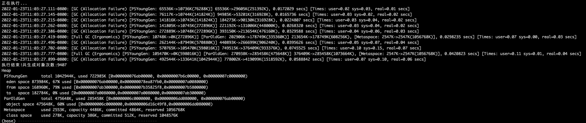

# GCLogAnalysis 使用说明
```shell
javac GCLogAnalysis.class
java  -XX:+PrintGCDetails  -Xloggc:gc.demo.log -XX:+PrintGCDateStamps GCLogAnalysis
```

```
2022-01-23T11:03:27.111-0800: [GC (Allocation Failure) [PSYoungGen: 65536K->10736K(76288K)] 65536K->29605K(251392K), 0.0172029 secs] [Times: user=0.02 sys=0.03, real=0.01 secs]
```
- 第一行`[PSYoungGen: 65536K->10736K(76288K)]` 表示发生 Young GC ,Young 区的内存从 65MB 变成了 10 MB，一共76MB
- 刚开始时，由于对象都在 Young 区，所以 Young区和堆的总占用都是 65536K
- Full GC 时 Young 区 被全部清空，Old 区下降得却很少
- Java 8 默认 GC 为 并行 GC

## 串行 GC
```shell
java -XX:+UseSerialGC -Xms512m -Xmx512m -XX:+PrintGCDetails  -XX:+PrintGCDateStamps GCLogAnalysis
```

## 并行 GC
```shell
java -XX:+UseParallelGC -Xms512m -Xmx512m -XX:+PrintGCDetails  -XX:+PrintGCDateStamps GCLogAnalysis
```

## CMS GC
```shell
java -XX:+UseConcMarkSweepGC -Xms512m -Xmx512m -XX:+PrintGCDetails  -XX:+PrintGCDateStamps GCLogAnalysis

```
## G1 GC
```shell
java -XX:+UseG1GC -Xms512m -Xmx512m -XX:+PrintGC  -XX:+PrintGCDateStamps GCLogAnalysis

```

# 内存查看工具
## 压测程序

1.可以从github获取
git clone https://github.com/kimmking/atlantis
cd atlantis\gateway-server
mvn clean package
然后在target目录可以找到gateway-server-0.0.1-SNAPSHOT.jar

2.也可以从此处下载已经编译好的：
链接：https://pan.baidu.com/s/1NbpYX4M3YKLYM1JJeIzgSQ
提取码：sp85

java -jar -Xmx512m -Xms512m gateway-server-0.0.1-SNAPSHOT.jar

## Mac

1.执行brew install wrk
如果显式brew update很慢，可以ctrl+C打断更新

2.输入 wrk
执行 wrk -t8 -c40 -d60s http://localhost:8088/api/hello

## 查看
### jvisualvm
- 命令行输入 jvisualvm
- 点击对应的pid，查看内存

