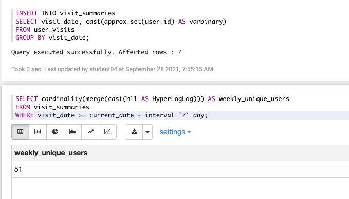

# HyperLogLog算法在Presto的应用

## 作业一
> 搜索HyperLogLog算法相关内容，了解其原理，写出5条 HyperLogLog的用途或大数据场景下的实际案例。

HyperLogLog 是一个用于集合去重计数的算法，估算在一批数据中，不重复的元素的个数有多少个。
它是近似相等的，特点：
- 当集合元素数量非常多时，它计算基数所需的空间总是固定的，而且还很小（稳定占用 12k 左右内存，可以统计 2^64 个元素）
- 统计规则基于概率完成，统计结果有误差，大约 0.81%

原理：
https://www.cnblogs.com/54chensongxia/p/13803465.html

使用：
- Flink 海量数据高效去重统计 UV


HyperLogLog 的 Java 实现代码
```java
HLL hll = new HLL(13/*log2m*/, 5/*registerWidth*/);
hll.addRaw(1);
hll.cardinality();
```

## 作业二
> 在本地docker环境或阿里云e-mapreduce环境进行SQL查询， 要求在Presto中使用HyperLogLog计算近似基数。（请自行创 建表并插入若干数据）

[参考链接](https://prestodb.io/docs/current/functions/hyperloglog.html)

**1. 建表**
``` sql
CREATE TABLE visit_summaries (
  visit_date date,
  hll varbinary
);
```
- varbinary 字节流，需要将 HyperLogLog 转为字节流存储

**2. 插入数据**
```sql
INSERT INTO visit_summaries
SELECT visit_date, cast(approx_set(user_id) AS varbinary)
FROM user_visits
GROUP BY visit_date;
```
- approx_set():返回一个去重后的 HyperLogLog


**3. 查询结果**
```sql
SELECT cardinality(merge(cast(hll AS HyperLogLog))) AS weekly_unique_users
FROM visit_summaries
WHERE visit_date >= current_date - interval '7' day;
```
- merge():返回聚合的 HyperLogLog
- cardinality(): 对 HyperLogLog 进行去重计数



## 作业三
> 学习使用Presto-Jdbc库连接docker或e-mapreduce环境，重复上述查询。
```sql
public class PrestoJDBC {
    public static void main(String[] args) {
        try {
            Connection conn = DriverManager.getConnection("jdbc:presto:///hive/default", "hadoop", null);
            Statement stmt = conn.createStatement();
            try {
                ResultSet rs = stmt.executeQuery("SELECT cardinality(merge(cast(hll AS HyperLogLog))) AS weekly_unique_users FROM visit_summaries WHERE visit_date >= current_date - interval '7' day");
                while (rs.next()) {
                    long uv = rs.getLong(1);
                    System.out.printf(String.valueOf(uv));
}
            } catch (Exception e) {
                e.printStackTrace();
} finally {
                stmt.close();
                conn.close();
}
        } catch (Exception e) {
            e.printStackTrace();
}
    }
}
```