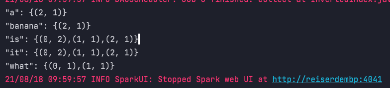

## 作业一 使用RDD API实现带词频的倒排索引

### 题目
> 倒排索引（Inverted index），也被称为反向索引。它是文档检索系统中最常用的数据结构。被广泛 地应用于全文搜索引擎。

例子如下，被索引的文件为（0，1，2代表文件名）
```shell
0. "it is what it is"
1. "what is it"
2. "it is a banana"
```
我们就能得到下面的反向文件索引：
``` json
"a": {2} 
"banana": {2} 
"is": {0, 1, 2} 
"it": {0, 1, 2} 
"what": {0, 1} 
```
再加上词频为： 
``` json
"a": {(2,1)} 
"banana": {(2,1)} 
"is": {(0,2), (1,1), (2,1)} 
"it": {(0,2), (1,1), (2,1)} 
"what": {(0,1), (1,1)}
```

### 让我想想
- wholeTextFiles 可以实现遍历目录，并且获取文件名

### 代码
```java
public class InvertedIndex {

    public static void main(String[] args) {

        SparkConf conf = new SparkConf();
        conf.setMaster("local");
        conf.setAppName(InvertedIndex.class.getSimpleName());

        JavaSparkContext sc = new JavaSparkContext(conf);

        //读取整个目录下的文件
        JavaPairRDD<String, String> files = sc.wholeTextFiles(args[0]);

        //拆分单词，并让单词携带文件名信息
        JavaRDD<Tuple2<String, String>> word = files.flatMap(new FlatMapFunction<Tuple2<String, String>, Tuple2<String, String>>() {
            @Override
            public Iterator<Tuple2<String, String>> call(Tuple2<String, String> fileNameContent) throws Exception {
                String[] filePath = fileNameContent._1.split("/");

                String fileName = filePath[filePath.length - 1];
                String line = fileNameContent._2;
                ArrayList<Tuple2<String, String>> result = new ArrayList<>();
                for (String word : line.split(" ")) {
                    result.add(new Tuple2<>(word, fileName));
                }
                return result.iterator();
            }
        });

        // 分组聚合
        JavaPairRDD<String, String> rdd = word.mapToPair((PairFunction<Tuple2<String, String>, String, String>) t -> new Tuple2<>(t._1, t._2));
        JavaPairRDD<String, String> rdd1 = rdd.reduceByKey((Function2<String, String, String>) (v1, v2) -> v1 + "|" + v2)
                .sortByKey();

        // 汇总统计
        JavaRDD<Tuple2<String, Map<String, Integer>>> rdd2 = rdd1.map(t -> {
            Map<String, Integer> map = new HashMap<>();
            for (String s : t._2.split("\\|")) {
                map.put(s, map.getOrDefault(s, 0) + 1);
            }
            return new Tuple2<>(t._1, map);
        });

        //打印
        for (Tuple2<String, Map<String, Integer>> next : rdd2.collect()) {
            List<String> list = new ArrayList<>();
            for (Map.Entry<String, Integer> entry : next._2.entrySet()) {
                list.add("(" + entry.getKey() + ", " + entry.getValue() + ")");
            }
            System.out.println("\"" + next._1 + "\": {" + StringUtils.join(",", list) + "}");
        }
        sc.close();
    }
}
```

### 运行结果


## 作业二 Distcp的spark实现

### 题目

### 让我想想

### 代码

### 运行结果