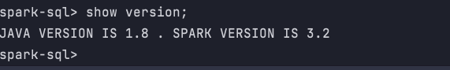
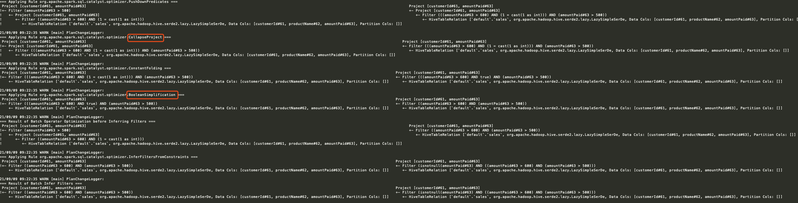
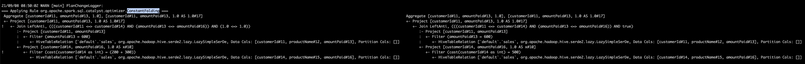
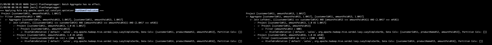
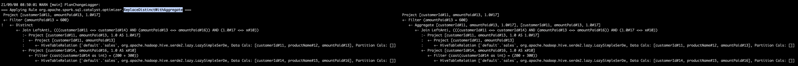
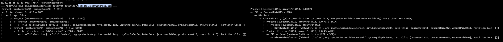
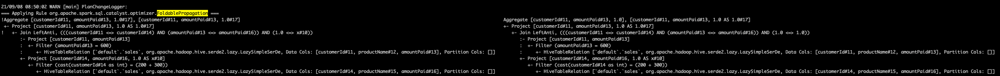
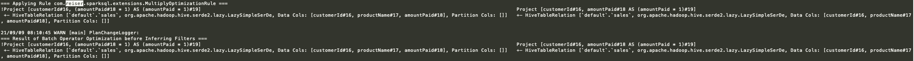

## 作业一
### 题目
> 为Spark SQL添加一条自定义命令
- SHOW VERSION;
- 显示当前Spark版本和Java版本

### 代码
**1.修改 SqlBase.g4**
- statement 增加 `SHOW VERSION  #showVersion`
- ansiNonReserved 增加 `VERSION`
- nonReserved 增加 `VERSION`
- KEYWORD-LIST 增加 `VERSION: 'VERSION';`

**2.编译 antlr4**
> 使用 Maven 工具中的 `Spark Project Catalyst` 的插件 `antlr4` 重新编译

**3.SparkSqlParser.scala 末尾增加以下代码**
```scala
  override def visitShowVersion(ctx: ShowVersionContext): LogicalPlan = withOrigin(ctx) {
    ShowVersionCommand()
  }
```

**4.实现 ShowVersionCommand**
```scala
case class ShowVersionCommand() extends LeafRunnableCommand{

  override val output: Seq[Attribute] =
    Seq(AttributeReference("version", StringType, nullable = true)())
  override def run(sparkSession: SparkSession): Seq[Row] = {
    val outputString = "JAVA VERSION IS " + System.getenv("JAVA_VERSION") + " . " +
      "SPARK VERSION IS " + System.getenv("SPARK_VERSION")
    Seq(Row(outputString))
  }
}
```

**4.打包**
```shell
build/sbt clean package -Phive -Phive-thriftserver 
```
**5.启动**
> 启动时注意 `SPARK_HOME`,必须配制成自己打包后的地址
```shell
export SPARK_HOME=/Users/reiserx/code/source/spark
export PATH=$SPARK_HOME/bin:$PATH
```

`JAVA_VERSION=1.8 SPARK_VERSION=3.2 bin/spark-sql -S`




## 作业二
### 题目 
> 构建SQL满足如下要求,通过 `set spark.sql.planChangeLog.level=WARN;` 查看 

#### 构建一条SQL，同时apply下面三条优化规则： 
- CombineFilters 
- CollapseProject 
- BooleanSimplification

#### 构建一条SQL，同时apply下面五条优化规则：
- ConstantFolding 
- PushDownPredicates 
- ReplaceDistinctWithAggregate 
- ReplaceExceptWithAntiJoin 
- FoldablePropagation

### 代码一
```sql
select a.customerId, amountPaid
from (select customerId, amountPaid from sales where amountPaid > 600 and 1='1') a
where amountPaid > 500;  
```

### 运行结果一
- CombineFilters: 尝试了很多方法 PushDownPredicates 都把 CombineFilters 给覆盖了，不知所措
- CollapseProject
- BooleanSimplification



### 代码二
```sql
select *
from (
         select customerId, amountPaid, 1.0
         FROM (select customerId, amountPaid from sales) a EXCEPT (select customerId, amountPaid, 1.0 x
                                                                   from sales
                                                                   where customerId = 200 + 300)
     )
where amountPaid = 600;
```
### 运行结果二
> ConstantFolding 常数折叠

 
> PushDownPredicates 谓词下推


> ReplaceDistinctWithAggregate


> ReplaceExceptWithAntiJoin


> FoldablePropagation 可折叠算子简化


## 作业三
### 题目 
> 实现自定义优化规则（静默规则）

### 代码和操作步骤

#### 1.编写代码
**MySparkSessionExtension.scala**
```scala
class MySparkSessionExtension extends (SparkSessionExtensions => Unit) { override def apply(extensions: SparkSessionExtensions): Unit = {
  extensions.injectOptimizerRule { session =>
    new MultiplyOptimizationRule()
  } }
}
```

**MultiplyOptimizationRule.scala**
```scala
class MultiplyOptimizationRule extends Rule[LogicalPlan] {
  def apply(plan: LogicalPlan): LogicalPlan = plan transformAllExpressions {
    case Multiply(left, right) if right.isInstanceOf[Literal]
      && right.asInstanceOf[Literal].value.asInstanceOf[Int] == 1 =>
      left
    case Multiply(left, right) if left.isInstanceOf[Literal]
      && left.asInstanceOf[Literal].value.asInstanceOf[Int] == 1 =>
      right
  }
}
```

#### 2.打包
> 生成 original-learn_spark-1.0-SNAPSHOT.jar


#### 3.运行
1.服务器启动
```shell
spark-sql --jars original-learn_spark-1.0-SNAPSHOT.jar --conf spark.sql.extensions=com.reiser.sparksql.extensions.MySparkSessionExtension
```
2.sql 执行,以方便查看优化过程，需 spark 3.x
```sql
set spark.sql.planChangeLog.level=WARN;
```
3.运行 sql
```sql
select customerId, amountPaid * 1 from sales;
```

### 运行结果
